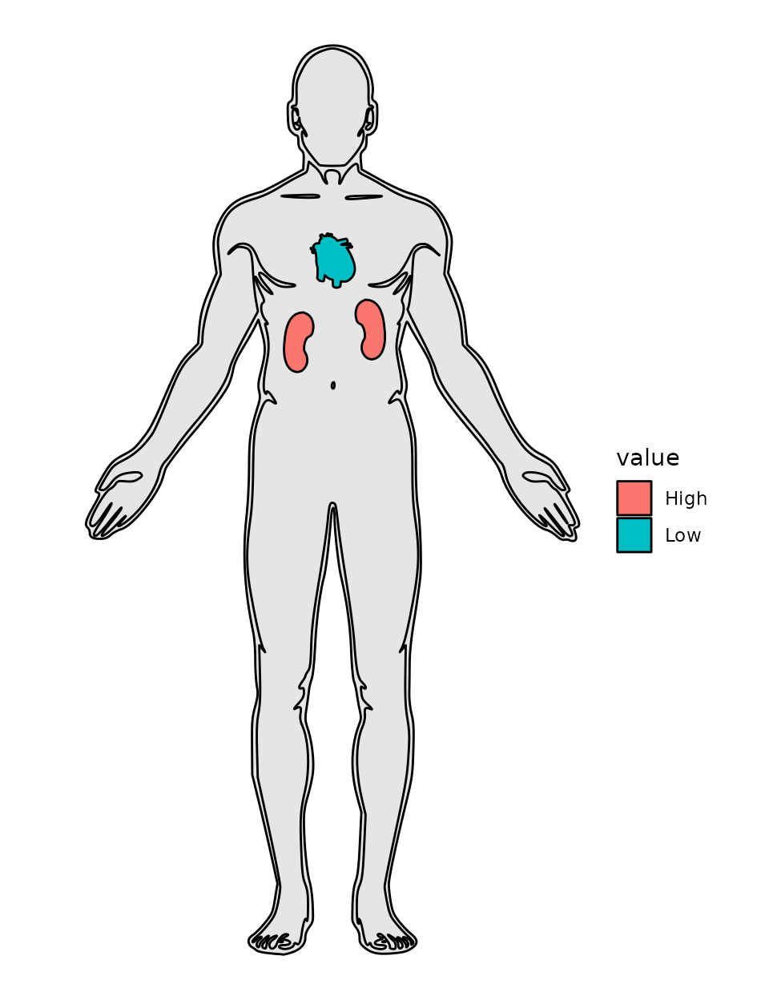
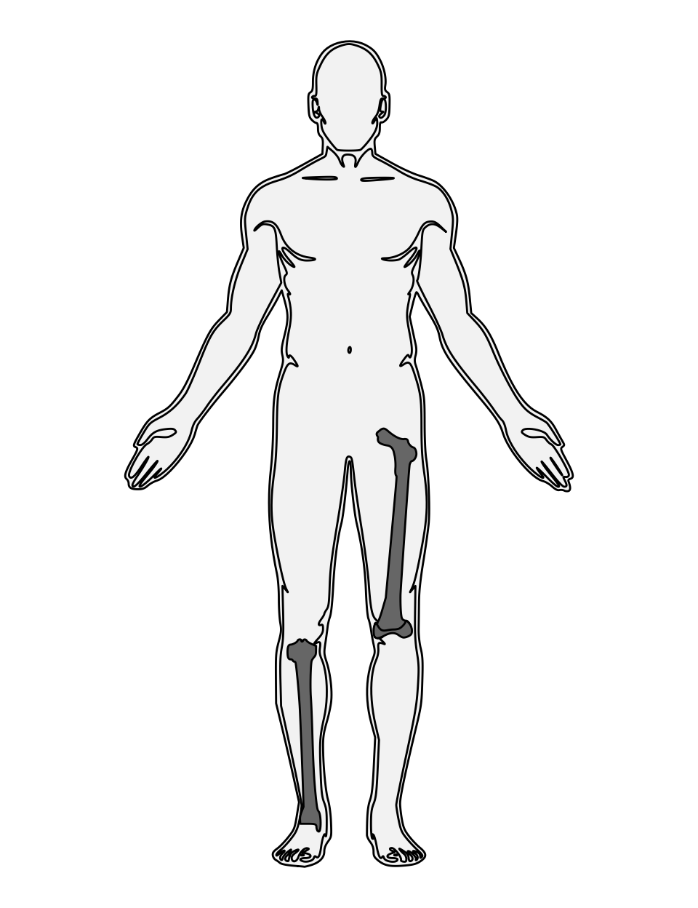
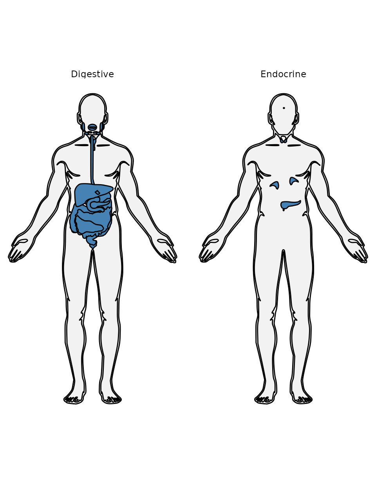
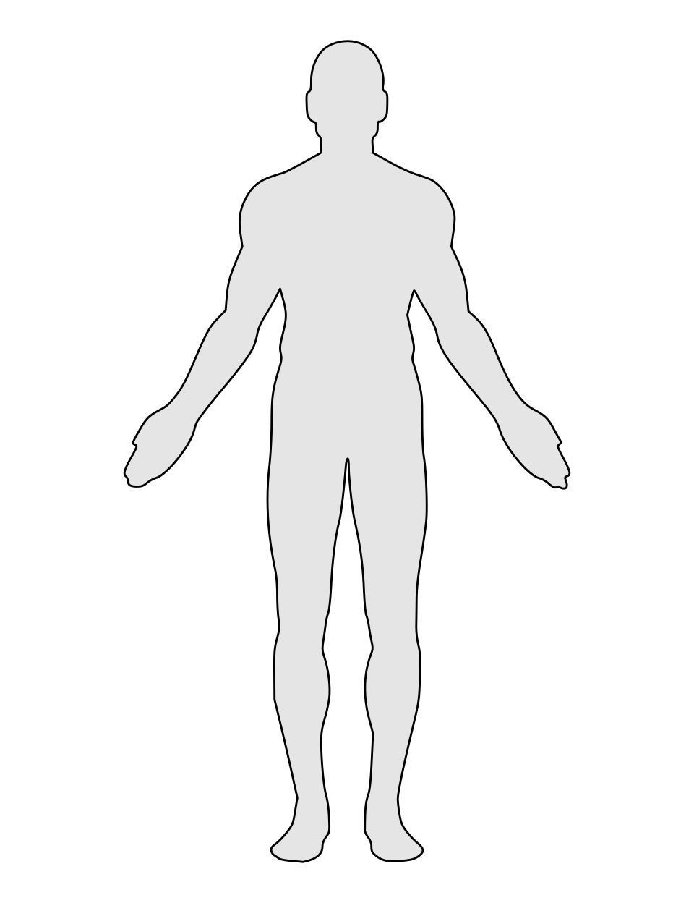

# Getting started with anatomogramdata

``` r

library(anatomogramdata)
library(ggplot2)
```

anatomogramdata is a **data package, not a plotting package**: it ships
tidy, ontology-tagged human anatomogram polygon data
(`hgMale`/`hgFemale`), parsed directly from the [EBI Expression Atlas
anatomogram
source](https://github.com/ebi-gene-expression-group/anatomogram) — not
a frozen hardcoded snapshot. There is no custom geom; you plot the
bundled data with
[`ggplot2::geom_polygon()`](https://ggplot2.tidyverse.org/reference/geom_polygon.html)
or
[`ggplot2::geom_map()`](https://ggplot2.tidyverse.org/reference/geom_map.html)
directly, which already provide full aesthetic flexibility.

[`anatomogram_select()`](https://petertanksley.github.io/anatomogramdata/reference/anatomogram_select.md)
is the package’s single entry point for browsing, selecting, and
filtering that data. It has three mutually exclusive modes.

## Browse mode

Call it with no arguments to see what’s available — every tissue and
which organ system(s) it belongs to:

``` r

head(anatomogram_select("male"))
#>    tissue_id tissue_name           system
#> 1 CL_0000084        <NA> Lymphatic/Immune
#> 2 CL_0000233        <NA>   Cardiovascular
#> 3 CL_0000236        <NA> Lymphatic/Immune
#> 4 CL_0000576        <NA> Lymphatic/Immune
#> 5 CL_0000623        <NA> Lymphatic/Immune
#> 6 CL_0000738   leukocyte Lymphatic/Immune
unique(anatomogram_select("male")$system)
#>  [1] "Lymphatic/Immune" "Cardiovascular"   "Respiratory"      "Endocrine"       
#>  [5] "Integumentary"    "Digestive"        "Reproductive"     "Nervous"         
#>  [9] "Muscular"         "Urinary"          "Skeletal"
```

## Organ mode: select specific organs, optionally with values

Pass `organs` as a character vector. Each element is matched either as a
literal ontology ID (e.g. `"UBERON_0000948"`) or fuzzily
(case-insensitive, partial) against the tissue name. Name an element to
attach a value to it — useful for `fill`:

``` r

d <- anatomogram_select("male", organs = c(kidney = "High", heart = "Low"))

ggplot(d, aes(x, y, group = group)) +
  geom_polygon(data = subset(d, tissue_id == "outline"),
               fill = "grey90", colour = "black") +
  geom_polygon(data = subset(d, tissue_id != "outline"),
               aes(fill = value), colour = "black") +
  coord_fixed() +
  theme_void()
```



Unnamed elements are pure selection, with no value attached:

``` r

selection_only <- anatomogram_select("male", organs = c("kidney", "heart"))
```

An organ name that matches zero tissues warns and is dropped rather than
failing the whole call; a name that matches more than one distinct
tissue (e.g. `"hippocampus"`, which has a left and a right entry under
separate ontology IDs) is an error listing the candidates, since the
ambiguity needs a decision you have to make, not one the package should
guess at.

## System mode: pull whole organ systems

Pass `system` instead of `organs` to select every tissue belonging to
one or more organ systems (Skeletal, Digestive, Nervous, and so on — see
\[organ_systems\] for the full list). The outline is included
automatically:

``` r

bones <- anatomogram_select("male", system = "Skeletal")

ggplot(bones, aes(x, y, group = group)) +
  geom_polygon(data = subset(bones, tissue_id == "outline"),
               fill = "grey95", colour = "black") +
  geom_polygon(data = subset(bones, tissue_id != "outline"),
               fill = "grey40", colour = "black") +
  coord_fixed() +
  theme_void()
```



Requesting more than one system is facet-ready — a tissue belonging to
more than one requested system (the pancreas, under both Digestive and
Endocrine) correctly appears once per system:

``` r

several <- anatomogram_select("male", system = c("Digestive", "Endocrine"))

ggplot(several, aes(x, y, group = group)) +
  geom_polygon(data = subset(several, tissue_id == "outline"),
               fill = "grey95", colour = "black") +
  geom_polygon(data = subset(several, tissue_id != "outline"),
               fill = "steelblue", colour = "black") +
  facet_wrap(~ system) +
  coord_fixed() +
  theme_void()
```



`organs` and `system` are mutually exclusive in a single call —
specifying both is an error. Call
[`anatomogram_select()`](https://petertanksley.github.io/anatomogramdata/reference/anatomogram_select.md)
twice and [`rbind()`](https://rdrr.io/r/base/cbind.html) the results if
you genuinely need both.

## The outline: silhouette vs. interior contour lines

`hgMale`/`hgFemale`’s `outline_role` column splits the body outline into
three roles, computed from geometry rather than any tag in the source
SVG (there isn’t one): `"silhouette"` (the plain outer body shape),
`"contour_detail"` (the same shape with interior finger/toe/joint
lines), and `"feature"` (small facial marks). Filter to just the roles
you want:

``` r

outline <- hgMale[hgMale$tissue_id == "outline", ]
clean_silhouette <- outline[outline$outline_role == "silhouette", ]

ggplot(clean_silhouette, aes(x, y, group = group)) +
  geom_polygon(fill = "grey90", colour = "black") +
  coord_fixed() +
  theme_void()
```



## Power-user plotting with `ggplot2::geom_map()`

[`anatomogram_select()`](https://petertanksley.github.io/anatomogramdata/reference/anatomogram_select.md)
covers the common cases, but `hgMale`/`hgFemale` already carry the
`id`/`group` columns and pre-flipped `y` that
[`ggplot2::geom_map()`](https://ggplot2.tidyverse.org/reference/geom_map.html)
needs as its `map` argument directly — useful when mapping more than one
aesthetic to real data (e.g. `fill` *and* `linewidth` together). See
`examples/geom_map_demo.R` and `examples/cause_of_death_demo.R` in the
package source for worked patterns.

## Attribution

The bundled data is parsed directly from the EBI Expression Atlas
anatomogram source (Apache-2.0 code / CC-BY-4.0 images) — see
`citation("anatomogramdata")` for how to cite both the package and the
underlying source.
